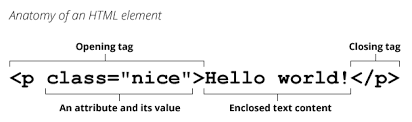

# Class 1 Reading Notes

## These topics are important because they lay the foundation of essential learning upon which more complex issues being taught later are built

### HTTP Poem 

### Q: Describe how HTML, CSS, and JS files are “parsed” in the browser  

(Source [MDN web docs](https://developer.mozilla.org/en-US/docs/Learn/Getting_started_with_the_web/How_the_Web_works))

* Browsers request HTML files that often contain CSS stylesheets and JavaScript elements.  
* The browser parses HTML first.  While this is happening, the browser recognizes references to stylesheets and script elements.  As HTML is parsing, the browser sends requests or the files found in the links and scripts.
* The browser, having parsed the HTML, generates Document Object Model (DOM)  and the CSS Object Model (CSSOM), and compiles and executes the JavaScript.
* The browser builds the DOM tree, applies the styles in the CSSOMand and executes the JavaScript, and displays the representation on the screen .

### Q: How can you find images to add to a Website?  

Source [mdn web docs](https://developer.mozilla.org/en-US/docs/Learn/Getting_started_with_the_web/What_will_your_website_look_like))

One can simply go to [Google Images[(<https://www.google.com/imghp?gws_rd=ssl>) and search.  One must be careful, however, to not use images that are copyrighted.  Using a license filter on Google Images (by clicking on _Tools_, _Usage Rights_ , and selecting _Creative Commons_.  

### Q: How do you create a String vs a Number in JavaScript?

(From [mdn web docs](https://developer.mozilla.org/en-US/docs/Learn/Getting_started_with_the_web/JavaScript_basics))

* To create a string, while creating a variable, enclose the value in quotes.

    > String example - myName = “Joe”;

* Numbers are created by simply typing the number without quotes.

    > Number example - myNum = 117;

### Q: What is a Variable and why are they important in JavaScript?  

Variables are used as containers to store values.  They are important in JavaScript because they can hold values that can be recalled later, as well as allowing them, in certain cases, to be changed.

### Q: What is an HTML attribute?

According to [mdn](https://developer.mozilla.org/en-US/docs/Learn/HTML/Introduction_to_HTML/Getting_started), HTML attributes contain extra information that is not visible in the actual content. Examples include "href=", "src=", which are used for links and image sources, respectively.

### Q: Describe the Anatomy of an HTMl element.



HTML elements usually include opening and closing tags, attributes, and text.

### Q: What is the Difference between ```<article>```a nd ```<section>``` element tags?

The ```<article>``` tag is used on stand-alone content, and the ```<section>``` is a part of a page that contains related content.

### Q: What Elements does a “typical” website include?

[mdn](https://developer.mozilla.org/en-US/docs/Learn/HTML/Introduction_to_HTML/Document_and_website_structure) states that typical websites include a header, nav bar, main conegtnt, sidebar, and footer.  

### Q: How does metadata influence Search Engine Optimization?

Metadata is the information, including key words that are not part of the actual content, used to describe the website that search engines use to optimize search results.  

### Q: How is the ```<meta>``` HTML tag used when specifying metadata? 

```<meta>``` tags contain information about an HTML document that increase visibility on search engine results by including descriptions, authors, charactersets, etc. that are seen by search engines, but not by the reader of the website.

## Miscellaneous

### Q: What is the first step to designing a Website?

According to [mdn web docs](https://developer.mozilla.org/en-US/docs/Learn/Common_questions/Thinking_before_coding), the first step to designing a website is project ideation, where the following questions are answered:

What do I want to accomplish?
How will the website allow me to accomplish this?
What does the designer need to do to reach these goals?

### Q: What is the most important question to answer when designing a Website?

Again, according to [mdn web docs](https://developer.mozilla.org/en-US/docs/Learn/Common_questions/Thinking_before_coding), the most important question to answer is “What exactly do I want to accomplish?”

### Q: Why should you use an ```<h1>``` element over a ```<span>``` element to display a top level heading?  

According to [mdn web docs - Semantics](https://developer.mozilla.org/en-US/docs/Glossary/Semantics), an ```<h1>``` is preferable to a ```<span>``` because, while they may look the same, the heading is more appropriate as it actually represents the data.

### Q: What are the benefits of using semantic tags in our HTML?

According to the same source as previous question, aemantic tags can have impacts on search engine optimization and screen readers for accessibility issues, among others.

### Q: Describe 2 things that require JavaScript in the Browser?

### Q: How can you add JavaScript to an HTML document?

According to [mdn web docs’ “What is JavaScript”](https://developer.mozilla.org/en-US/docs/Learn/JavaScript/First_steps/What_is_JavaScript), Javascript can be added through:

* Internal Javascript: Enclosing JavaScript functions inside of ```<script></script>``` tags within the HTML page

* External JavaScript: Adding a .js file to the HTML directory, including a script tag with the destination included inside, ```<script src = ”script.js”></script>```.  The actual JavaScript code is written in the linke .js file.

* Inline JavaScript – another way, but it is a bad idea, so ignore.

[Home](README.md)